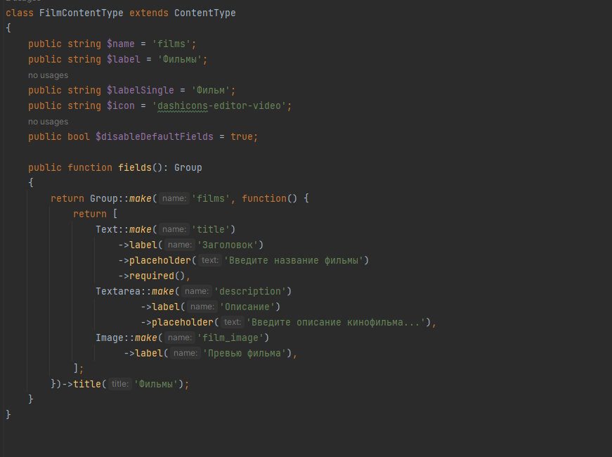
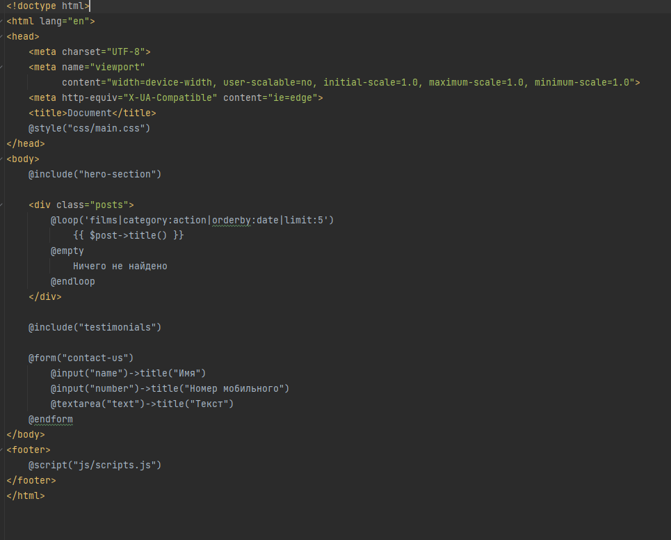
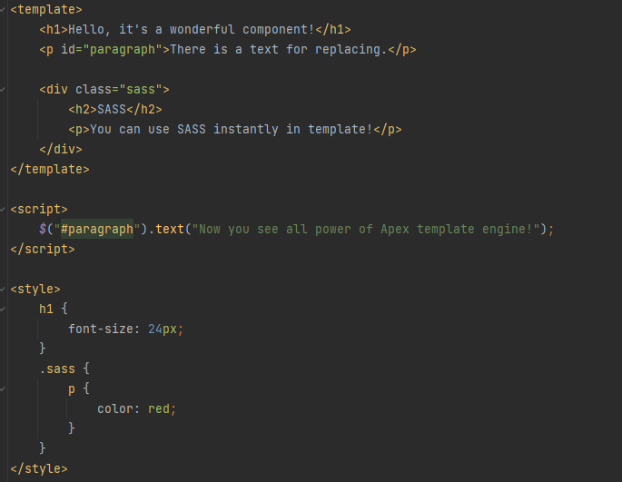
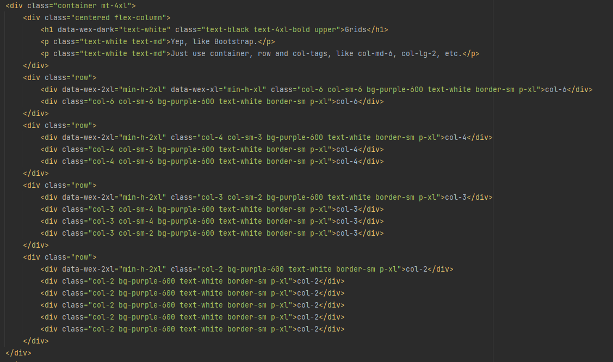
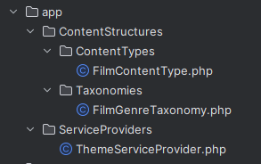
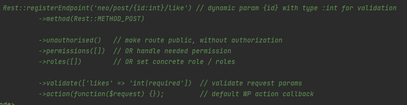

# Neo WP Framework [v0.0.1]

> Код - это поэзия.  
> <b>Neo</b> — твоя кисть.

Шаблонизатор - единственный новый навык который тебе придется освоить, все остальное - по пути, ведь Neo не приносит ничего нового в мир WordPress, а лишь делает его более элегантным, лаконичным, простым и минималистичным.

Декларативность - главный концепт фреймворка. Разница между стандартным подходом WordPress и декларативным в том, что декларативность говорит ЧТО делать, а не как. В примерах ниже ты можешь найти регистрацию кастомного типа записи, и ты увидишь всю мощь декларативности наяву!

# Обзор возможностей

## Декларативный подход к разработке.

## Мощный шаблонизатор .

## Компонентный подход к верстке.

## Внутренний CSS-фреймворк а-ля Bootstrap + Tailwind.
Все уже придумано за тебя, можешь даже не касаться CSS-кода.  
Привычный bootstrap-подход в связке с мощным Tailwind дают нечто невообразимое.  
Библиотека кастомная и имеет опцию подключения через CDN без сборщиков и тонн кода.  
При желании можешь отдельно подключать сетку, отдельно цвета - все в твоих руках!    
Все цвета, отступы, жирность шрифтов подобраны UX-грамотно, и симфонично - создавая оркестр гармонии.  
Все шрифты адаптированы под 4к+ дисплеи, и динамически подстраиваются под них как и под мобилки, планшеты и десктопы.    

## Чистая архитектура.

[//]: # (## Сервис провайдеры.)

## Удобные классы для работы с WordPress.

